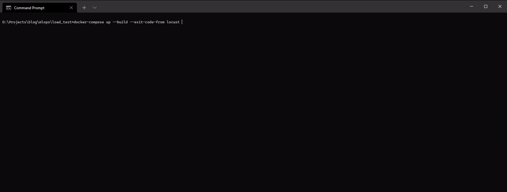

# Auto Load Test with locust for FastAPI

<p style="text-align:center">
 


</p>
<br>

Used [reco](https://github.com/silverstone1903/reco-model-monitoring) API for load testing. 

---

#### Folder Structure
```
|   docker-compose.yml
|   readme.md
|   tree.txt
+---app
|       Dockerfile
|       main.py
|       requirements.txt
|       utils.py
+---assets
|       locust-1.jpg
|       locust-2.jpg
|       locust-3.jpg
+---data
|       customer_item_matrix.parquet
|       df.parquet
|       item_item_sim_matrix.parquet
|       user_user_sim_matrix.parquet
\---locust
        locustfile.py

```


## Installation

There are only two prerequisites:

* [Docker](https://docs.docker.com/get-docker/)
* [Docker-compose](https://docs.docker.com/compose/install/)

<br>

``` bash
git clone https://github.com/silverstone1903/auto-load-testing
```

## Usage
### Settings
You can change load test values in [docker-compose.yml](https://github.com/silverstone1903/auto-load-testing/blob/master/docker-compose.yml#L10=). locust works with 50 users, 2 hatch rate and 10 seconds run time by default. When run time limit reached docker stopping locust container and then app looks unhealty. To prevent this I added `--exit-code-from {container}` command to run compose. When locust finishes compose stopping the remain container and shut downs the app.

```yaml
command: -f /mnt/locust/locustfile.py --headless -u 50 -r 2 --run-time 10s --host http://fastapi:8000
```


### Start 

``` bash
docker-compose up --exit-code-from locust
```

If you make any changes you can add `--build`. 

```bash
docker-compose up --build --exit-code-from locust
``` 

### Stopping containers

```bash
docker-compose down 
```

### Container Logs
If you want to check locust results you can use `logs`. Uvicorn app works with  `--log-level critical` so there won't be any fastapi related logs. You can easily check locust aggregated results.

```bash
docker-compose logs --tail 50
```

* FastAPI: http://localhost:8000

<br>

Blog post (in Turkish): [Auto Load Testing - FastAPI + locust](https://silverstone1903.github.io//posts/2022/04/auto-load-testing/)

<br>

# Screenshots
## Locust Results
<p align="center">
  
   
  
  <!--  -->
</p>


